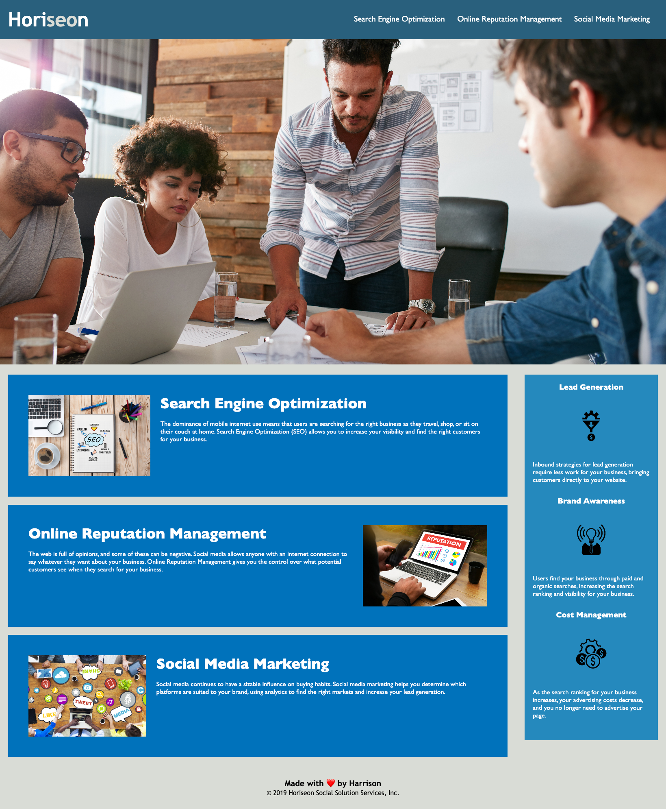

# codingChallenge1

In this challenge we wanted to increase the accessibitly of the clients website. We did this through adding semantic element tags, adding alt attributes to pictures and icons, and making sure the flow of the page was easy to follow. 

# Description

The goal of this project was to increase the accessibilty of our clients website. The purpose is to help someone that cannot read the page understand the content. We added 5 parts to this website more accessible:

*Added semantic HTML elements to define the header, footers, and when new sections start.
*Made sure elements followed a logical structure independent of styling and positioning.
*Add Alternative attibutes to imagines and icons to explain what each image is.
*Made sure heading attributes followed a sequential order to avoid confusion.
*Created a title that was concise and descriptiv.

# Getting Started

To Run:

*Open this link in your browser to see the deployed website: 

This is what the webpage should look:

# Author 
Harrison Cooper